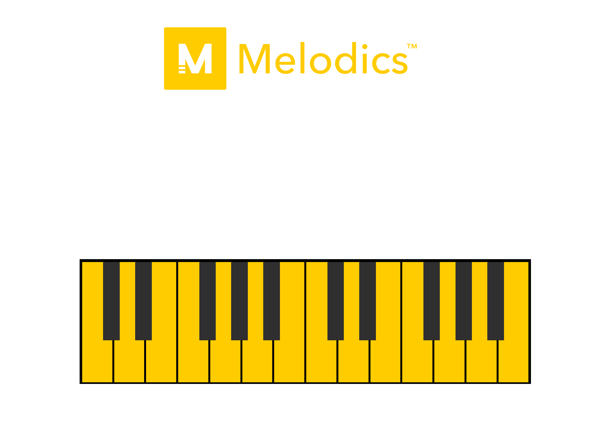

# melodicsFlare
https://melodicsflare.tadhgconnolly.repl.co/

This is a quickly put together web-app to temp Melodics into interviewing me :)

I normally don't have my JavaScript, CSS, and HTML all in one file, but I thought it would be an interesting learning exercise. I was wrong. Might come back and refactor this at some point into seperate files.